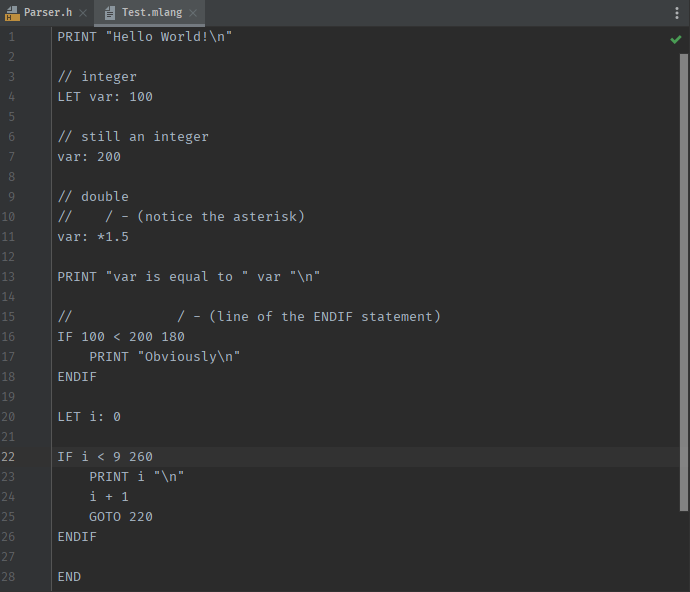
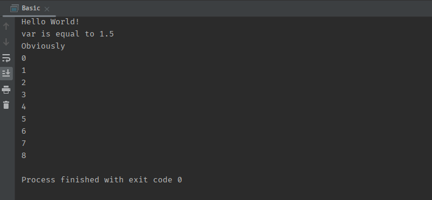

# MyLang

A BASIC styled language

# Why

Why not?

# How to use

1. I'm use CLion so I just add the ```.mlang``` to the Program arguments
2. If you are compiling through the command line...
  * I am using CMake
  * Arguments are:

```MLangExec Test.mlang``` (Just running it normally)

```MLangExec Test.mlang -d``` (Running it, but seeing the debug output)

# Learning 

Go to the [Docs](docs) directory to see how to use MyLang

# Before && After



