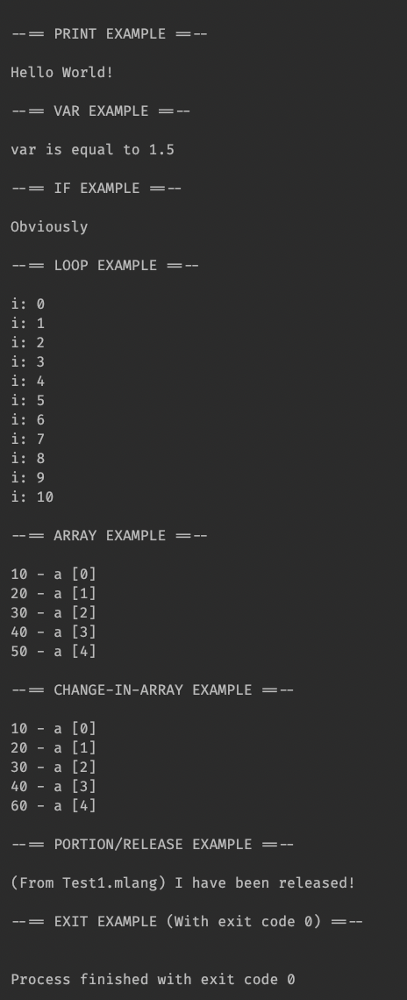

# MyLang

A BASIC styled language

# Why

Why not?

# How to use

1. I'm use CLion so I just add the ```.mlang``` to the Program arguments
2. If you are compiling through the command line...
  * I am using CMake
  * Arguments are:

```MLangExec Test.mlang``` (Just running it normally)

```MLangExec Test.mlang -d``` (Running it, but seeing the debug output)

# Learning 

Go to the [Docs](docs) directory to see how to use MyLang

# Before && After

```PRINT "\n\n--== PRINT EXAMPLE ==--\n\n"

PRINT "Hello World!"

PRINT "\n\n--== VAR EXAMPLE ==--\n\n"

// integer
LET var: 100

// still an integer
var: 200

// double
//    / - (notice the asterisk)
var: *1.5

PRINT "var is equal to " var

PRINT "\n\n--== IF EXAMPLE ==--\n\n"

//             / - (line of the ENDIF statement)
IF 100 < 200 240
    PRINT "Obviously"
ENDIF

PRINT "\n\n--== LOOP EXAMPLE ==--\n\n"

LET i: 0

IF i < 11 340
    PRINT "i: " i "\n"
    i + 1
    GOTO 300
ENDIF

PRINT "\n--== ARRAY EXAMPLE ==--\n\n"

ARR a: 10 20 30 40 50

LET o: 0

IF o < 5 460
    PRINT a o " - a [" o "]\n"
    o + 1
    GOTO 420
ENDIF

PRINT "\n--== CHANGE-IN-ARRAY EXAMPLE ==--\n\n"

a 4: 60

o: 0

IF o < 5 580
    PRINT a o " - a [" o "]\n"
    o + 1
    GOTO 540
ENDIF

PRINT "\n--== PORTION/RELEASE EXAMPLE ==--\n\n"

PORTION TEST > "../PortionedCode.mlang"

RELEASE TEST

PRINT "\n\n--== EXIT EXAMPLE (With exit code 0) ==--\n\n"

END 0```


